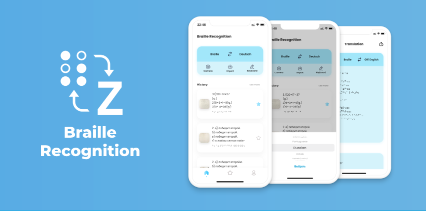
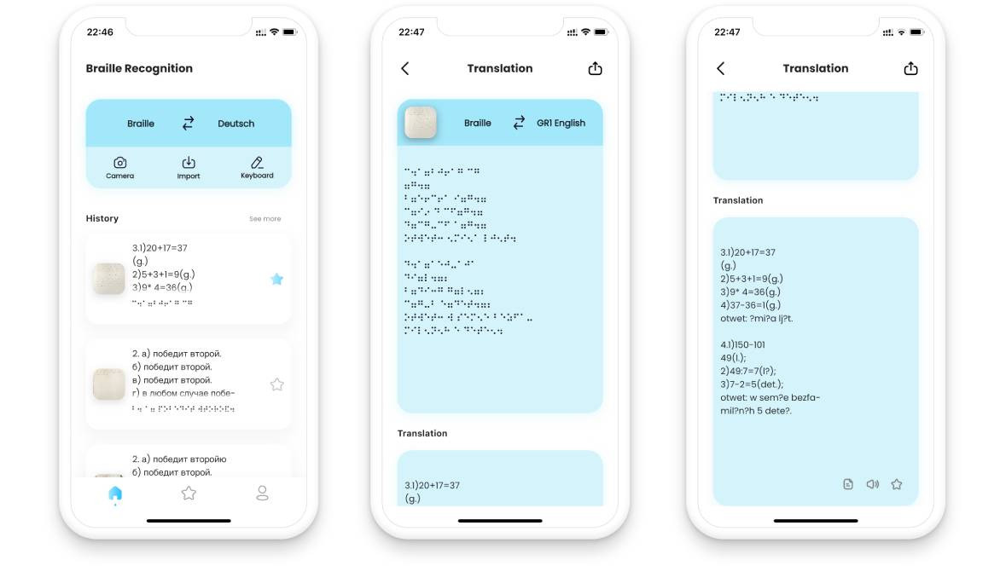

# BrailleRecognition - README

---

## Available on
AppStore: [AppStoreLink](https://apps.apple.com/ru/app/braille-recognition/id1669110413)
GooglePlay: [GooglePlayLink](https://play.google.com/store/apps/details?id=uz.mq.braillerecognition)

## About the Project

**BrailleRecognition** is a powerful tool designed to help educators, parents, and caregivers translate and interpret Braille text from images captured on mobile devices. The app leverages a custom machine learning model to detect and translate Braille characters, enabling efficient support for individuals with visual impairments.

### Key Features
- **Braille Text Recognition**: Translate Braille text from images captured using your mobile phone.
- **Custom ML Model**: A YOLOv8-based machine learning model optimized for Braille detection.
- **User-Friendly Interface**: Intuitive Flutter-based mobile application.
- **Multi-language Support**: Translate Braille into multiple languages (subject to availability).

---

## Folder Structure

### `ClientApp`
This folder contains the source code for the **Flutter mobile application**. It serves as the client-side interface for capturing images, sending requests, and displaying translated Braille text.

### `ServerSide`
This folder contains the **custom machine learning model** for detecting and translating Braille. It includes:
- Pre-trained YOLOv8 weights.
- Python scripts for handling image processing, Braille character detection, and translation.

---

## How It Works

1. **Image Capture**: Users take a photo of Braille text using the mobile app.
2. **Image Processing**: The image is sent to the server, where it undergoes preprocessing.
3. **Braille Detection**: The YOLOv8 model identifies Braille characters and their positions.
4. **Translation**: Detected Braille is translated into readable text.
5. **Result Display**: Translated text is sent back to the mobile app and displayed to the user.

---

## Installation

### Prerequisites
- Flutter SDK installed on your machine.
- Python 3.8+ and required libraries for the server-side model.
- Compatible hardware (4-core processor; GPU optional but recommended).

---

## Screenshots

### Mobile App

---

## Official Website

Visit the official website for more information: [BrailleRecognition](https://braillerecognition.alfocus.uz/)

---

## Contacts

For inquiries or support:
- **Email**: mabduvoitov@icloud.com
- **Phone**: +998(99)898-75-70
